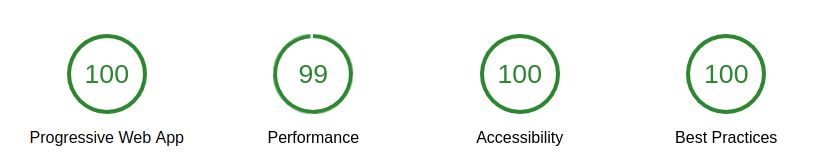

# Benchmarks

## Lighthouse

(As of 2017-07-01)



HTTP2 (and HTTPS) was achieved via [Caddy](https://caddyserver.com/)

## Stress test with `wrk`

Tested on a development machine with `wrk -t12 -c400 -d30s http://localhost:8080/`

**Vue 2.3 with runInNewContext: false**

```
Running 30s test @ http://localhost:8080/
  12 threads and 400 connections
  Thread Stats   Avg      Stdev     Max   +/- Stdev
    Latency     1.30s   160.70ms   2.00s    89.71%
    Req/Sec    48.64     47.17   242.00     81.82%
  8265 requests in 30.09s, 87.08MB read
  Socket errors: connect 0, read 0, write 0, timeout 597
Requests/sec:    274.71
Transfer/sec:      2.89MB
```

**Vue 2.3 with runInNewContext: true**

```
Running 30s test @ http://localhost:8080/
  12 threads and 400 connections
  Thread Stats   Avg      Stdev     Max   +/- Stdev
    Latency     1.08s   507.01ms   1.99s    60.00%
    Req/Sec     8.49      8.73    50.00     83.92%
  400 requests in 30.09s, 4.42MB read
  Socket errors: connect 0, read 0, write 0, timeout 300
Requests/sec:     13.29
Transfer/sec:    150.28KB
```


**Vue pre 2.3**

```
Running 30s test @ http://localhost:8080/
  12 threads and 400 connections
  Thread Stats   Avg      Stdev     Max   +/- Stdev
    Latency     1.12s   480.17ms   1.97s    59.63%
    Req/Sec    29.21     21.48   120.00     66.20%
  2924 requests in 30.09s, 32.08MB read
  Socket errors: connect 0, read 0, write 0, timeout 2763
Requests/sec:     97.16
Transfer/sec:      1.07MB
```
